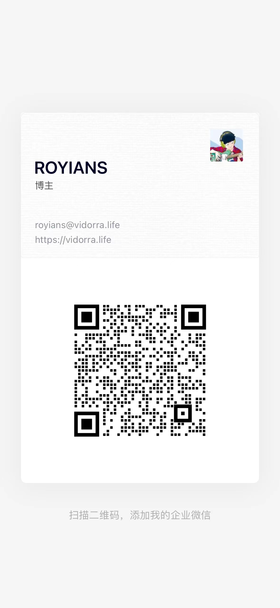

<div align="center">
  
  <h1>Print Template Designer</h1>
  <p><strong>面向报表开发者与设计师的专业 Web 打印模板设计器</strong></p>
  <p>Framework-agnostic core · React designer · Versioned template API</p>
</div>

> [!IMPORTANT]
> 当前仓库正在进行 v2 重写。核心模型、渲染组件、React 编辑器、多页面管理、GitHub 登录、模板版本 API 与完整自托管容器栈已经落地；Web 的模板保存/打开流程和导出能力尚未实现。原 Vue 2 版本保存在 [`legacy/`](./legacy/) 中，仅供参考。

## 项目定位

Print Template Designer（PTD）不是一个只能独立运行的页面 Demo，也没有把技术路线限定为 Web Component。v2 将产品拆成三个可以独立演进的层次：

- **可嵌入的设计器内核**：Schema、单位换算、序列化、数据绑定和组件注册表不依赖 UI 框架。
- **专业 React 编辑器**：提供完整的画布工作区、组件目录、属性面板和编辑命令。
- **可演进的完整应用**：Vite Web Host 与 NestJS 模板服务已经存在，后续将接通持久化、数据预览和导出流程。

当前更准确的描述是：**可用的专业编辑器基础 + 尚在集成中的完整应用**。

## 当前能力

### 设计器

- Canvas-first 工作区：工具坞、资源面板、上下文工具栏、属性面板、状态栏。
- 选择、多选、框选、拖动、缩放、旋转、锁定、组合与图层操作。
- 复制、剪切、定位粘贴、Undo/Redo、右键菜单和键盘命令。
- 真实标尺、悬停预览线、可固定和着色的参考线。
- 文本框、直线、矩形、椭圆、星形的画布拖拽绘制，以及 Hand Tool。
- 多页面新增、复制、删除和排序。
- 宽屏、标准与紧凑三种响应式工作区布局。
- 文本、表格、图像、编码、图形五类组件目录，并区分可用组件与规划组件。

### 引擎与服务

- 框架无关的 `TemplateSchema`、页面配置、序列化、数据绑定和组件注册表。
- 原生 DOM 渲染组件：文本、表格、图像、二维码、条码和基础图形。
- NestJS + Prisma + PostgreSQL 多用户模板 API，支持 GitHub OAuth、Allowlist、owner 隔离、不可变版本快照、恢复和乐观并发控制。
- GitHub Actions 构建 Web/Server 镜像并发布到 GHCR；Compose 管理 PostgreSQL、migration、Server 和同源 Web 入口。

### 成熟度边界

| 模块                  | 当前状态         | 说明                                                    |
| --------------------- | ---------------- | ------------------------------------------------------- |
| `@ptd/core`           | 已实现           | Schema、单位、序列化、数据绑定、组件注册表              |
| `@ptd/components`     | 已实现           | 框架无关 DOM 渲染组件                                   |
| `@ptd/react-designer` | 已实现，持续打磨 | Controlled React 编辑器和专业画布交互                   |
| `apps/web`            | 认证 Host 已实现 | GitHub 登录已连接 Server；模板仍在内存中，尚未接入 CRUD |
| `apps/server`         | API 已实现       | PostgreSQL、Better Auth、owner 隔离和模板/版本 API      |
| `@ptd/export`         | 空脚手架         | PDF、打印、Word 和自动溢出分页均未实现                  |

## 架构

```text
apps/web (React + Vite) ───────────────┐
                                      ▼
                              @ptd/react-designer
                                      │
                         ┌────────────┴────────────┐
                         ▼                         ▼
                  @ptd/components             @ptd/core
                         │                         ▲
                         └─────────────────────────┘

apps/server (NestJS + Prisma + PostgreSQL) ──── @ptd/core

@ptd/export ── 当前仅为脚手架，尚未进入运行链路
```

```text
packages/
  core/             框架无关的数据模型与引擎
  components/       原生 DOM 渲染组件
  react-designer/   React 专业编辑器
  export/           规划中的导出包
apps/
  web/              独立设计器 Host
  server/           模板持久化与版本 API
docker/             Web/Server 镜像与 Nginx 同源代理配置
legacy/             只读的 Vue 2 版本
```

更完整的代码边界见 [Monorepo 架构规范](./.trellis/spec/monorepo/index.md)。

## 快速开始

### 环境要求

- Node.js **22.12 或更高版本**（CI 与 Docker 使用 Node 22）。
- 通过 Corepack 使用仓库声明的 pnpm **10.15.1**。

虽然部分 package 的 `engines` 仍允许 Node 20，完整开发、CI 与容器环境统一使用 Node 22，以减少工具链和 Prisma 运行时差异。

### 启动 Web 设计器

```bash
corepack enable
corepack pnpm install
corepack pnpm dev
```

根 `dev` 命令会按依赖顺序构建 `core`、`components`、`react-designer`，再同时启动 package watch 和 Vite。默认访问地址通常为 <http://localhost:5173>。

### 启动模板服务

Web 的登录与准入检查依赖 Server。复制 `apps/server/.env.example` 并配置 PostgreSQL/GitHub OAuth 后，可单独启动 API：

```bash
corepack pnpm --filter server prisma:migrate:deploy
corepack pnpm --filter server start:dev
```

默认服务地址为 <http://localhost:3000>，健康检查为 `GET /healthz`。`DATABASE_URL` 必须指向 PostgreSQL；没有本地文件数据库回退。

更完整的环境、命令和原生依赖排障见 [DEVELOPMENT.md](./DEVELOPMENT.md)。

## 在 React Host 中使用

v2 packages 当前只在本仓库 workspace 中使用，**尚未发布到 npm**。下面展示真实的受控组件 API，而不是 npm 安装说明：

```tsx
import { useState } from 'react'
import { Designer, type TemplateSchema } from '@ptd/react-designer'
import '@ptd/react-designer/styles.css'

export function TemplateEditor({ initialValue }: { initialValue: TemplateSchema }) {
  const [template, setTemplate] = useState(initialValue)

  return (
    <Designer
      value={template}
      onChange={setTemplate}
      onSave={(next) => saveTemplate(next)}
      onLoad={() => loadTemplate()}
    />
  )
}
```

`DesignerProps` 当前只有四项：

| 属性       | 类型                                              | 说明                      |
| ---------- | ------------------------------------------------- | ------------------------- |
| `value`    | `TemplateSchema`                                  | 必填，Host 持有的当前模板 |
| `onChange` | `(value) => void`                                 | 编辑器产生变更时通知 Host |
| `onSave`   | `(value) => void`                                 | 用户触发保存时调用        |
| `onLoad`   | `() => TemplateSchema \| Promise<TemplateSchema>` | 用户触发载入时调用        |

样式需要由 Host 显式导入。API 与集成约束见 [`@ptd/react-designer` README](./packages/react-designer/README.md)。

## Server API

模板服务提供以下 HTTP 端点：

| 方法                     | 路径                                           | 用途                       |
| ------------------------ | ---------------------------------------------- | -------------------------- |
| `GET`                    | `/healthz`                                     | 健康检查                   |
| `GET` / `POST`           | `/api/templates`                               | 列表 / 创建                |
| `GET` / `PUT` / `DELETE` | `/api/templates/:id`                           | 读取 / 更新 / 删除         |
| `GET`                    | `/api/templates/:id/versions`                  | 版本列表                   |
| `GET`                    | `/api/templates/:id/versions/:version`         | 读取指定快照               |
| `POST`                   | `/api/templates/:id/versions/:version/restore` | 将历史快照恢复为一个新版本 |

更新和恢复请求必须携带 `expectedVersion`。版本过期时返回 `409 Conflict`，以避免静默覆盖其他写入。请求体和响应语义见 [Server README](./apps/server/README.md)。

## 多页面与自动分页

`TemplateSchema.pages` 表示用户手动管理、需要持久化的设计页面。未来的数据驱动自动溢出分页属于预览/打印/导出阶段生成的派生页面，不应写回手工页面，也不应污染编辑历史。这两个概念在 v2 中有意保持分离。

## Docker 部署

当前生产链路交付完整自托管栈：

```text
GitHub Actions → 前后端质量/容器构建 → GHCR Web + Server 镜像
                                            ↓
                  PostgreSQL → migration → Server → Nginx Web/API
```

服务器不需要 Node.js 或 pnpm：

```bash
git clone https://github.com/ROYIANS/print-template-designer.git
cd print-template-designer
cp .env.example .env
# 编辑 .env 中所有 CHANGE_ME、公开 origin 和 GitHub OAuth 配置
./deploy.sh
```

默认访问 `http://<server-ip>:8080`。PowerShell 7、HTTPS 反向代理、GitHub callback、数据库卷、备份、私有 GHCR、版本固定和回滚说明见 [DEPLOYMENT.md](./DEPLOYMENT.md)。

## 模块文档

| 模块            | 文档                                                                       |
| --------------- | -------------------------------------------------------------------------- |
| Web Host        | [`apps/web/README.md`](./apps/web/README.md)                               |
| Template Server | [`apps/server/README.md`](./apps/server/README.md)                         |
| Core            | [`packages/core/README.md`](./packages/core/README.md)                     |
| Components      | [`packages/components/README.md`](./packages/components/README.md)         |
| React Designer  | [`packages/react-designer/README.md`](./packages/react-designer/README.md) |
| Export scaffold | [`packages/export/README.md`](./packages/export/README.md)                 |
| 开发指南        | [`DEVELOPMENT.md`](./DEVELOPMENT.md)                                       |
| 部署指南        | [`DEPLOYMENT.md`](./DEPLOYMENT.md)                                         |
| 变更记录        | [`CHANGELOG.md`](./CHANGELOG.md)                                           |

## 路线图

接下来的主线按依赖顺序推进：

1. 完善 Host 集成钩子与应用边界。
2. 让 `apps/web` 接入模板列表、保存、版本历史、恢复和冲突处理。
3. 重构数据源引用与数据预览流程。
4. 实现预览、打印、PDF/Word 导出与派生自动分页。
5. 完善备份恢复、监控和多架构容器发布。

图表、签名、条件显示、字体管理、批量打印和多语言属于后续扩展，不应被理解为当前能力。

## Legacy v1

Vue 2 时代的源码、资源和实现记录保存在 [`legacy/`](./legacy/) 中，不再维护，也不会被 v2 运行时代码引用。

- npm 历史版本：[print-template-designer](https://www.npmjs.com/package/print-template-designer)
- v1 的 `ptd-designer` / `ptd-viewer` API 与 v2 不兼容。
- v1 曾包含的预览和导出实现不代表 v2 已具备同等功能。

## 联系与参考

- 作者：ROYIANS
- Email：<royians@vidorra.life>
- Website：<https://vidorra.life>



主要参考项目：

- [report-designer](https://github.com/xinglie/report-designer)
- [printer-editor](https://github.com/xinglie/printer-editor)
- [visual-drag-demo](https://github.com/woai3c/visual-drag-demo)
- [vue-email-editor](https://github.com/unlayer/vue-email-editor)

## License

[MIT](./LICENSE) © ROYIANS

[](https://star-history.com/#ROYIANS/print-template-designer&Date)
